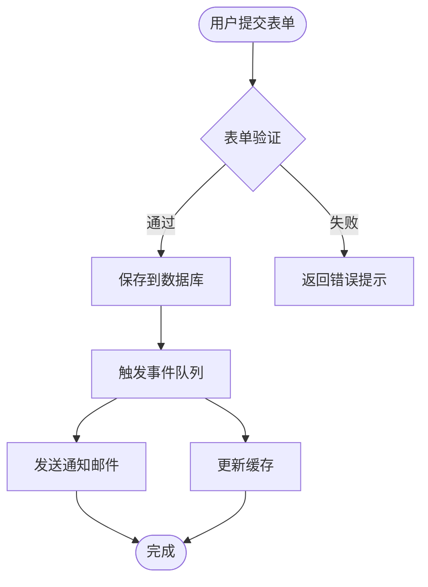
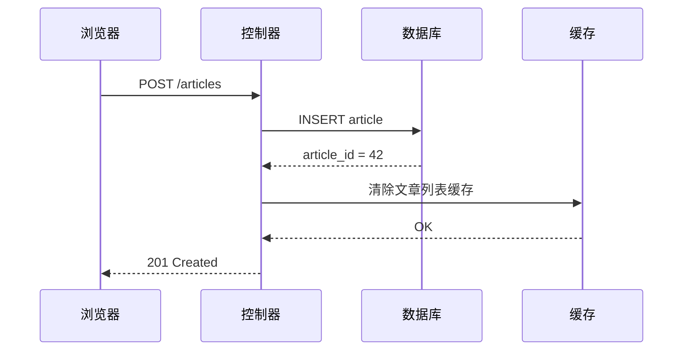
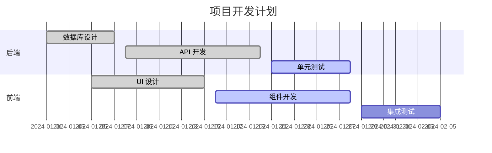
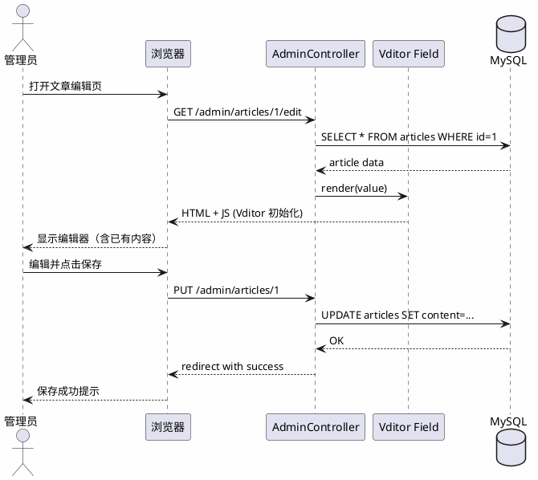

# Vditor 功能测试文档

[toc]

---

## 1. 文字格式

**粗体**、*斜体*、~~删除线~~、`行内代码`、==高亮标记==

中英文混排自动空格：测试autoSpace效果，English and 中文之间会自动加空格。

修正术语拼写：github → GitHub，javascript → JavaScript，ios → iOS。

---

## 2. 表格

| 功能模块 | 状态 | 说明 |
|----------|:----:|------|
| 代码高亮 | ✅ | hljs，github / monokai 主题 |
| 数学公式 | ✅ | KaTeX，支持行内和块级 |
| Mermaid  | ✅ | 流程图、时序图、甘特图等 |
| ECharts  | ✅ | 柱状图、折线图、饼图等 |
| Markmap  | ✅ | 思维导图 |
| Flowchart.js | ✅ | 简单流程图 |
| Graphviz | ✅ | DOT 语言图形 |
| PlantUML | ✅ | UML 图表 |
| 图片预览 | ✅ | 悬停预览 |
| PDF 上传 | ✅ | 插入为链接格式 |
| 深色模式 | ✅ | 跟随系统自动切换 |

---

## 3. 任务列表

- [x] 集成 Vditor 编辑器
- [x] 开启代码高亮、行号
- [x] 配置 KaTeX 数学公式
- [x] 实现图片上传
- [x] 自动深色模式
- [ ] 配置 hint.extend（需要业务数据）
- [ ] 补全多语言映射

---

## 4. 引用与脚注

> 工欲善其事，必先利其器。— 《论语·卫灵公》

Vditor 是一款浏览器端的 Markdown 编辑器[^1]，支持所见即所得、即时渲染、分屏预览三种模式[^2]。

[^1]: Vditor 由 B3log 团队开发，开源地址：https://github.com/Vanessa219/vditor
[^2]: 三种模式可通过工具栏右侧的「编辑模式」按钮切换。

---

## 5. 数学公式（KaTeX）

行内公式：质能方程 $E = mc^2$，欧拉公式 $e^{i\pi} + 1 = 0$。

块级公式：

$$
\int_{-\infty}^{+\infty} e^{-x^2} dx = \sqrt{\pi}
$$

$$
\begin{pmatrix}
a & b \\
c & d
\end{pmatrix}
\begin{pmatrix}
x \\ y
\end{pmatrix}
=
\begin{pmatrix}
ax + by \\ cx + dy
\end{pmatrix}
$$

---

## 6. 代码高亮

```php
<?php

namespace App\Admin\Controllers;

use Dcat\Admin\Form;
use Dcat\Admin\Grid;

class ArticleController extends AdminController
{
    protected function grid(): Grid
    {
        return Grid::make(Article::with('author'), function (Grid $grid) {
            $grid->column('id')->sortable();
            $grid->column('title', '标题');
            $grid->column('author.name', '作者');
            $grid->column('created_at', '创建时间');
        });
    }

    protected function form(): Form
    {
        return Form::make(new Article(), function (Form $form) {
            $form->text('title', '标题')->required();
            $form->vditor('content', '正文');
        });
    }
}
```

```javascript
// 自动深色模式检测
const mq = window.matchMedia('(prefers-color-scheme: dark)');
const applyTheme = (dark) => {
    editor.setTheme(
        dark ? 'dark' : 'classic',
        dark ? 'dark' : 'light',
        dark ? 'monokai' : 'github'
    );
};
mq.addEventListener('change', e => applyTheme(e.matches));
```

```sql
SELECT
    a.id,
    a.title,
    u.name AS author,
    COUNT(c.id) AS comment_count
FROM articles a
LEFT JOIN users u ON u.id = a.user_id
LEFT JOIN comments c ON c.article_id = a.id
WHERE a.status = 'published'
GROUP BY a.id
ORDER BY a.created_at DESC
LIMIT 10;
```

---

## 7. Mermaid 流程图







---

## 8. ECharts 图表

```echarts
{
  "title": { "text": "月度访问量统计" },
  "tooltip": { "trigger": "axis" },
  "legend": { "data": ["PV", "UV"] },
  "xAxis": {
    "type": "category",
    "data": ["1月","2月","3月","4月","5月","6月","7月","8月","9月","10月","11月","12月"]
  },
  "yAxis": { "type": "value" },
  "series": [
    {
      "name": "PV",
      "type": "bar",
      "data": [12000, 9800, 15000, 13200, 18500, 21000, 19800, 23000, 17500, 20100, 16800, 25000]
    },
    {
      "name": "UV",
      "type": "line",
      "smooth": true,
      "data": [4200, 3800, 5600, 4900, 6800, 7500, 7100, 8200, 6300, 7400, 6100, 9000]
    }
  ]
}
```

```echarts
{
  "title": { "text": "流量来源分布", "left": "center" },
  "tooltip": { "trigger": "item" },
  "legend": { "bottom": "5%" },
  "series": [{
    "type": "pie",
    "radius": ["40%", "70%"],
    "data": [
      { "value": 4235, "name": "搜索引擎" },
      { "value": 2840, "name": "直接访问" },
      { "value": 1920, "name": "社交媒体" },
      { "value": 980,  "name": "邮件推广" },
      { "value": 520,  "name": "其他" }
    ]
  }]
}
```

---

## 9. Markmap 思维导图

```markmap
# Vditor 功能体系

## 编辑模式
- 所见即所得 (WYSIWYG)
- 即时渲染 (IR)
- 分屏预览 (SV)

## 内容格式
- 标准 Markdown
- GFM 扩展
  - 任务列表
  - 表格
  - 删除线
- 数学公式 KaTeX
- 代码高亮 hljs

## 图表渲染
- Mermaid
- ECharts
- Markmap
- Flowchart.js
- Graphviz
- PlantUML

## 文件上传
- 图片
- PDF
- 外链转内链

## 主题
- 深色 / 浅色
- 跟随系统
- 内容主题 4 种
```

---

## 10. Flowchart.js

```flowchart
st=>start: 开始
e=>end: 结束
op1=>operation: 读取配置文件
cond=>condition: 配置有效?
op2=>operation: 初始化应用
op3=>operation: 显示错误信息

st->op1->cond
cond(yes)->op2->e
cond(no)->op3->e
```

---

## 11. Graphviz

```graphviz
digraph AdminArchitecture {
    rankdir=LR
    node [shape=box, style=filled, fontname="Arial"]

    Request [label="HTTP Request", fillcolor="#dae8fc"]
    Router  [label="Router", fillcolor="#d5e8d4"]
    Auth    [label="Auth Middleware", fillcolor="#ffe6cc"]
    Ctrl    [label="AdminController", fillcolor="#d5e8d4"]
    Form    [label="Form / Grid", fillcolor="#e1d5e7"]
    Model   [label="Eloquent Model", fillcolor="#fff2cc"]
    DB      [label="Database", fillcolor="#f8cecc", shape=cylinder]

    Request -> Router -> Auth -> Ctrl
    Ctrl -> Form -> Model -> DB
    DB -> Model -> Form -> Ctrl
}
```



---

## 12. PlantUML



---

## 13. 图片


---

## 14. 链接与媒体

[Vditor 官网](https://b3log.org/vditor/) — Markdown 编辑器

[Dcat Admin 文档](https://dcatadmin.com) — Laravel 后台框架

---

## 15. 分割线与缩进

正文段落首行空格（`paragraphBeginningSpace`）：

　　这是一段带首行缩进的正文。在中文排版中，段落开头通常需要两个全角空格作为缩进，Vditor 会自动处理这个格式。

　　第二段同样有首行缩进，整体阅读体验更接近印刷排版风格。

---

*文档生成完毕。将以上内容完整复制粘贴进编辑器即可验证所有功能。*
